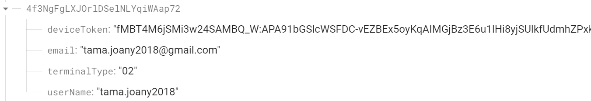
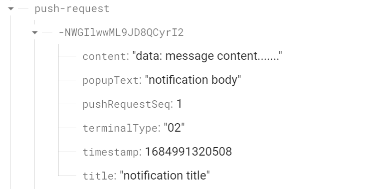

# spring-boot-firebase-demo

## 前提準備
  1.サーバーに Firebase Admin SDK を追加する　[参照](https://firebase.google.com/docs/admin/setup)  
　　* 前提条件   
　　* Firebase プロジェクトとサービス アカウントの設定

  2.秘密鍵ファイルを生成する  
<span style="font-size: 85%;">
　　* <a href="https://console.firebase.google.com/">Firebase コンソール</a>で、[プロジェクトの概要] >[プロジェクトの設定] > [サービス アカウント] を開く。  
　　* [新しい秘密鍵の生成] をクリックし、[キーを生成] をクリックして確定する。   
　　* キーを含む JSON ファイルを[src/main/resources]に保存し、名前を[service-account-adminsdk.json]に変更する。
</span> 

  3.Firebase Authenticationを設定する  
<span style="font-size: 85%;">
　　* <a href="https://console.firebase.google.com/">Firebase コンソール</a>で、[Authentication] セクションを開く。  
　　* [Sign-in method] タブで [メール / パスワード] を有効にして、[保存] をクリックする。
</span>

  4.データベースを作成する　[参照](https://firebase.google.com/docs/database/android/start)  
<span style="font-size: 85%;">
　　* データベースを作成する。  
　　* データベースのURLを[src/main/resources/application.properties]の[realtime-database-url]に設定する。  
　　* firebase-android-demoを起動して、データベースの中に、"users"というキーとその値が存在する。
</span>


## 説明  
  Androidアプリ(firebase-android-demo)：   
　　1.ユーザーデバイストークンを取得し、データベースに保存する（usersの下）。 
    
  
  本プロジェクト：  
　　1.データベースからユーザーデバイストークンを取得する。  
　　2.ユーザーごとにデバイスに通知メッセージを送信する。  
　　3.通知メッセージをデータベースに保存する。   
   
  

## 実行  
  1.プロジェクトを起動する。  
  2.下記のコマンドを実行する。  
      terminalType :   (01:iPhoneApp. 02:AndroidApp)

``` 
curl -v -H "Content-Type:application/json" http://localhost:8080/send-fcm -d "{
  "title": "Match update",
  "body": "Arsenal goal in added time, score is now 3-0",
  "data": {
    "Nick": "Mario",
    "body": "great match!",
    "Room": "PortugalVSDenmark"
  },
  "click_action": "OPEN_ACTIVITY_1",
  "category": "NEW_MESSAGE_CATEGORY"
}" 

```


